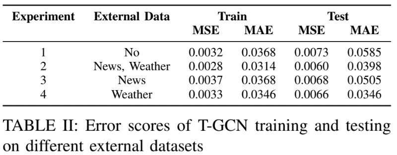
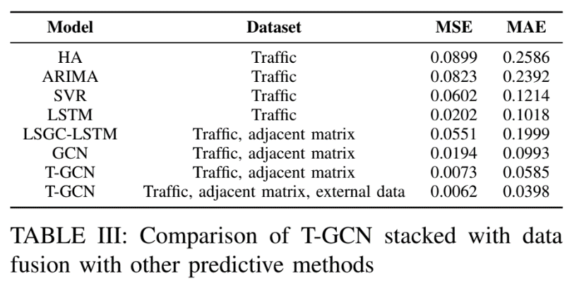
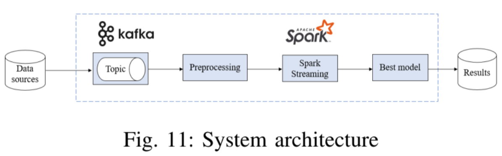

# Realtime Traffic Flow Prediction using Temporal-Graph Convolutional Network and external attributes

This is the repository for the final project of DS200 (Big Data Analysis) of the University of Information Technology (UIT).

In intelligent transportation systems (ITS), predicting traffic flow is always a pressing concern, especially in light of the current big data boom. An ITS must be able to anticipate large volumes of data in real-time. The research on traffic predictions mentioned above has changed throughout the years using a variety of methods. Traffic flow at a fixed location is not only influenced by its historical data but also by external ones. Nevertheless, relatively few studies use a wide range of variables, such as weather conditions and traffic incidents, in the job of prediction. We thus employ a Temporal-Graph convolutional network (T-GCN) coupled with external elements on the presumption that their inclusion can enhance the spatial accuracy of traffic prediction and increase interpretability. When compared to conventional traffic prediction algorithms, tests on actual datasets demonstrate the efficiency of external information considerations on traffic forecasting jobs. MSE and MAE scores received on the predictions are 0.006 and 0.0398, respectively. Our team experimented with the model based on big data to anticipate real-time traffic and achieve successful outcomes.

## Dataset
We use a directed graph to demonstrate the traffic network. Each node in a graph has a main feature and two auxiliary ones, which are traffic flow, traffic incidents, and weather conditions, respectively. Details about each type of feature are explained in our project report Section III.B <code>./Real-time Traffic Flow Prediction using Temporal-Graph Convolution Network and external attributes.pdf</code>

The dataset used in this project can be accessed and downloaded via this Google Drive link: [url](https://drive.google.com/drive/u/6/folders/195STGUi89GSxq6iVeAwZPca2OSpXo04w)
<ol>
 <li>
  <code>distance.csv</code> contains the distances among 33 traffic counters. This file is used to construct the adjacent matrix.
 </li>
 <li>
  <code>node_features.txt</code> contains the figures for all features for each node in the graph: traffic flow, traffic incidents, 26 weather attributes (rain, temperature,...)
 </li>
</ol>

The dataset can also be created from scratch using <code>./Create Dataset.ipynb</code> and <code>./Data Preprocess.ipynb</code>

## Run Experiments
Model T-GCN was trained with different types of data:

<ol>
 <li>
  <code>./tgcn/T-GCN-traffic.ipynb</code>: T-GCN is trained on only traffic flow.
 </li>
 <li>
  <code>./tgcn/T-GCN-traffic-weather.ipynb</code> T-GCN is trained on traffic flow and weather attributes.
 </li>
 <li>
  <code>./tgcn/T-GCN-traffic-news.ipynb</code> T-GCN is trained on traffic flow and traffic incidents.
 </li>
 <li>
  <code>./tgcn/T-GCN-traffic-news-weather.ipynb</code> T-GCN is trained on all features.
 </li>
</ol>

We also compared the performance of T-GCN with several baseline models. The source code for baseline models is located in in folder <code>./baselines</code>.

## Results

  

Experiment 2 which utilizes both traffic incidents and weather condition have the best performance in general. Although learning with no external data has a good training result just after experiment 2, the test error score is the highest among the 4 experiments. This indicates that the model trained in experiment 1 is the most overfitting one. Between 2 types of auxiliary attributes, the weather seemed to be more helpful in prediction.

  

The results imply that T-GCN is the best method among baseline models to extract both spatial and temporal relationships from the data.

## Real-time Prediction
Real-time data are streamed via Kafka and raw data is then delivered into Spark streaming-integrated components. After preprocessing data, it is put into trained T-GCN for prediction.

  

